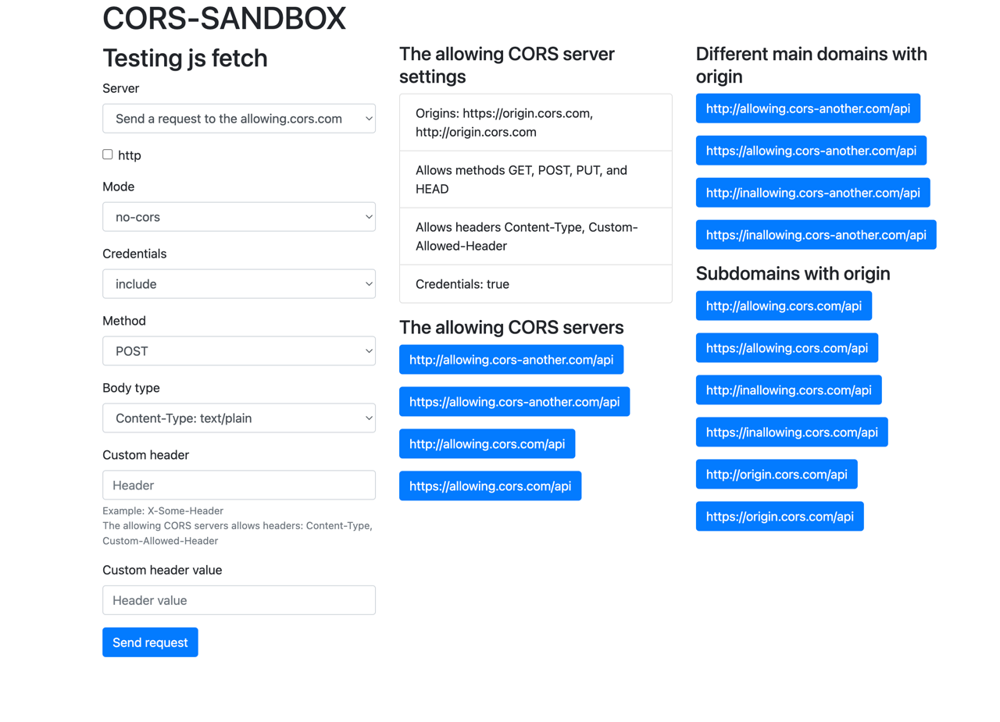

# CORS
This sandbox allows testing CORS requests with options:
- mode
- credentials
- headers
- methods
- content type



The result can be seen in the console log. 
Using tools like Burpsuite you can see real requests to the server with responses. 

## Client site settings Mode
### Mode cors (default) 
If the request is not of the same origin:
- For methods GET, HEAD, and POST, the browser will send the request. JS can read the response only if the server returns the right CORS headers.
- For other methods, the browser first sends the OPTIONS method to the server to ask for permissions. If the server returns the right CORS headers, the browser will send the request. JS can read the response only if the server returns the right CORS headers.
- In some cases for GET, HEAD, and POST the browser will send options too. For example, if custom headers are used, or content type is been application/json. Read more in [3](#references)

### Mode no-cors
If the request is not of the same origin:
- Request method is limited to GET, HEAD, or POST. The browser will **do** request to the server but js will **not** have access to the response.
- If the request method is not one of these the browser will return an error and the request will **not** be sent to the server.

### Mode same-origin.
If this mode is set and the origin isn't the same, an error will be occurred.
The request will **not** be sent to the server.

## Server CORS implementation
- Server allows requests from origin http://127.0.0.1:3000 with credentials. 
- Server allows methods GET, POST, PUT, and HEAD.
- Server allows headers Content-Type.
```go
    handler := handlers.CORS(
		handlers.AllowedOrigins([]string{"http://127.0.0.1:3000"}),
		handlers.AllowedHeaders([]string{"Content-Type"}),
		handlers.AllowCredentials(),
		handlers.AllowedMethods([]string{"GET", "POST", "PUT", "HEAD"}),
	)(routerAnotherServer)
```
## Run the sandbox in unsafe browser mode
Close all chrome instances and run in terminal:

MacOS
```bash
open -na Google\ Chrome --args --user-data-dir=/tmp/temporary-chrome-profile-dir --disable-web-security --disable-site-isolation-trials
```
See details here [4](#references)

Kali Linux
```bash
google-chrome  --user-data-dir="~/google-chrome-data" --disable-web-security
```


Go to http://127.0.0.1:3000

## References
1. https://developer.mozilla.org/en-US/docs/Web/API/Request/mode
2. https://developer.mozilla.org/en-US/docs/Web/API/Fetch_API/Using_Fetch
3. https://developer.mozilla.org/ru/docs/Web/HTTP/CORS
4. https://stackoverflow.com/questions/35432749/disable-web-security-in-chrome-48
